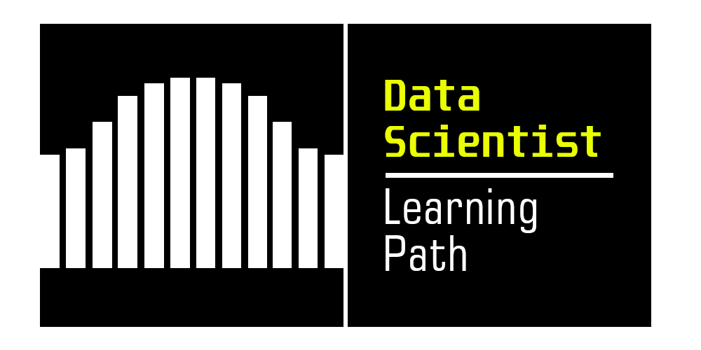
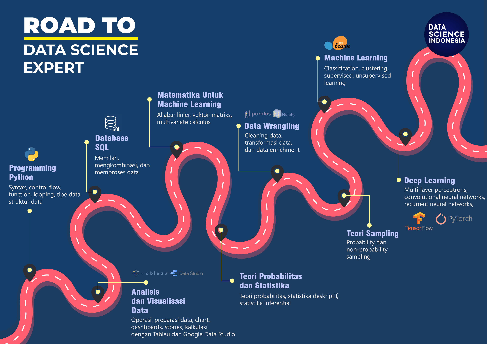

<table align="center">
<tr>
<td align="center" width="9999">

# Data Scientist Learning Path

</td>
</tr>
</table>
---

## Daftar Isi
  * [Apa itu *Data Science* dan Siapa itu *Data Scientist*?](#apa-itu-data-science-dan-siapa-itu-data-scientist)
  * [Apa yang dilakukan oleh seorang *Data Scientist*?](#apa-yang-dilakukan-oleh-seorang-data-scientist)
  * [Apa saja yang harus dikuasai oleh seorang *Data Scientist*?](#apa-saja-yang-harus-dikuasai-seorang-data-scientist)
  * [*Learning Path* Menjadi *Data Scientist*](#learning-path-menjadi-data-scientist)
  * [*Data Scientist Toolbox*](#data-scientist-toolbox)
  * [Daftar *Course*](#daftar-course)
      * [1. Pemrograman Menggunakan Python](#1-pemrograman-menggunakan-python)
      * [2. Analisis dan Visualisasi Data Menggunakan Tableau](#2-analisis-dan-visualisasi-data-menggunakan-tableau)
      * [3. Teknik Visualisasi Data Menggunakan Google Data Studio](#3-teknik-visualisasi-data-menggunakan-google-data-studio)
      * [4. Pengolahan Database Menggunakan SQL](#4-pengolahan-database-menggunakan-sql)
      * [5. Probabilitas dan Statistika](#5-probabilitas-dan-statistika)
      * [6. Matematika Untuk *Machine Learning*](#6-matematika-untuk-machine-learning)
      * [7. Data Wrangling](#7-data-wrangling)
      * [8. Teori Sampling](#8-teori-sampling)
      * [9. Machine Learning](#9-machine-learning)
      * [10. Deep Learning](#10-deep-learning)

## Apa itu *Data Science* dan Siapa itu *Data Scientist*?

Semua orang sedang membicarakan *Data Science* saat ini. Hal itu wajar sejak rilisnya suatu [artikel Harvard Business Review (HBR)](https://hbr.org/2012/10/data-scientist-the-sexiest-job-of-the-21st-century) yang menobatkan *Data Scientist* sebagai "*The Sexiest Job of the 21st Century*" pada tahun 2012 silam. Tidak lama setelah itu pula menjamur berbagai *Massive Open Online Course* (MOOC), konten artikel, video, *podcast*, serta pelatihan tentang *Data Science*. 

Lalu, apa itu sebenarnya Data Science? Dan siapakah Data Scientist?

Data Science bisa dikatakan sebagai perpaduan antara **ilmu komputer**, **statistika/matematika**, dan ***domain expert* tertentu**. Ada suatu lelucon yang bahkan mengilustrasikan seorang Data Scientist sebagai seseorang yang lebih paham statistika lebih baik dari *computer scientist* dan yang lebih paham *computer science* daripada seorang *statistician*. Dalam bukunya, [***Data Science from Scratch***](https://joelgrus.com/2019/05/13/data-science-from-scratch-second-edition/), Joel Grus menitikberatkan *Data Scientist* sebagai seorang yang mengekstrasi *insights* dari *messy data* yang sangat besar saat ini di dunia digital. 

Tidak jauh berbeda pula dengan yang didefinisikan juga dalam buku *[**Data Science**](https://mitpress.mit.edu/books/data-science) **Handbook*** karangan John D. Kelleher dan Brendan Tierney yang mengatakan bahwa Data Science merupakan ilmu mencakup seperangkat **prinsip**, **definisi masalah**, **algoritma**, dan **proses untuk mengekstraksi** *non-obvius* dan *useful patterns* dari suatu kumpulan data yang besar. 

Meskipun saat ini pada beberapa kasus di industri, *boundary* seorang dikatakan seorang *Data Scientist* juga tidak seberapa jelas. Beberapa ada yang mirip dengan *jobdesk* seorang *Machine Learning Engineer* seperti membuat suatu model prediksi dan ada pula yang lebih cenderung melakukan analisis dan ekstraksi *insights* dan membuat laporan.

Masih belum paham definisi di atas? Langsung cek artikel-artikel di bawah ini.
- [What Is Data Science, and What Does a Data Scientist Do?](https://www.innoarchitech.com/blog/what-is-data-science-does-data-scientist-do)
- [Introduction: What Is Data Science?](https://www.oreilly.com/library/view/doing-data-science/9781449363871/ch01.html) (Doing Data Science by Cathy O'Neil, Rachel Schutt) 
- [What is data science?](https://matthew-brett.github.io/dsfe/chapters/01/what-is-data-science) by Matthew Brett
- [What on earth is data science?](https://medium.com/hackernoon/what-on-earth-is-data-science-eb1237d8cb37#:~:text=teach%20my%20students%3A-,Data%20science%20is%20a%20'concept%20to%20unify%20statistics%2C%20data%20analysis,analyze%20actual%20phenomena'%20with%20data.&text=%E2%80%9CData%20science%20is%20the%20discipline%20of%20making%20data%20useful.%E2%80%9D,-What%20you're) by Cassie Kozyrkov
- [A New Definition of Data Science in Academic Programs](https://towardsdatascience.com/a-new-definition-of-data-science-in-academic-programs-2d48ad6db8b7) by Thu Vu

## Apa yang dilakukan oleh seorang Data Scientist?
- Melakukan analisis terhadap data
- Mengekstraksi suatu *insight* dari data
- Melakukan pemodelan (*machine learning*/*deep learning*) terhadap data untuk menemukan pola/*pattern*

## Apa saja yang harus dikuasai seorang Data Scientist?
- Ilmu statistika, stokastik, dan probabilitas
- Ilmu aljabar linier dan *multivariate calculus*
- Teknik visualisasi data
- Teknik storytelling
- Domain expert tertentu (sesuai dengan *case problem*)
- *Machine learning*
- *Deep Learning*

## Learning Path Menjadi Data Scientist
*Path* untuk menjadi *Data Science Expert*

<table align="center">
<tr>
<td align="center" width="9999">

</td>
</tr>
</table>

## *Data Scientist* *Toolbox*
- Bahasa pemrograman: Python/R
- *Coding environment*: 
    - [Jupyter Notebook](https://jupyter.org/)
    - [Jupyter Lab](https://jupyterlab.readthedocs.io/en/stable/)
    - [R Studio](https://rstudio.com/)
    - [VS Code](https://code.visualstudio.com/)
- Visualization Software
    - [Tableau](https://www.tableau.com/)
    - [Google Data Studio](https://datastudio.google.com/)
    - [Power BI](https://powerbi.microsoft.com/en-us/)
- Library 
    - Visualisasi: 
        - [Matplotlib](https://matplotlib.org/)
        - [Seaborn](https://seaborn.pydata.org/)
        - [Bokeh](https://docs.bokeh.org/en/1.0.0/)
        - [ggplot](http://ggplot.yhathq.com/)
        - [plotly](https://dash.plotly.com/)
    - *Dataframe processing*:
        - [Pandas](https://pandas.pydata.org/)
        - [PySpark](https://spark.apache.org/docs/latest/api/python/pyspark.html)
        - [SFrame](https://apple.github.io/turicreate/docs/api/generated/turicreate.SFrame.html)
    - *Machine Learning*:
        - [Scikit-learn](https://scikit-learn.org/stable/)
        - [Machine Learning Library (MLlib)](http://spark.apache.org/docs/latest/ml-guide.html)
        - [XGBoost](https://xgboost.readthedocs.io/en/latest/)
        - [H2O](https://docs.h2o.ai/h2o/latest-stable/h2o-docs/index.html#)
        - [statsmodels](https://www.statsmodels.org/stable/index.html)
        - [Turi Create-Modelling](https://apple.github.io/turicreate/docs/api/turicreate.toolkits.html)
    - *Deep Learning* *framework*:
        - [Pytorch](https://pytorch.org/)
        - [Tensorflow](https://www.tensorflow.org/)
        - [Keras](https://keras.io/)
        - [MXNet](https://mxnet.apache.org/versions/1.7.0/)
        - [Caffe](https://caffe.berkeleyvision.org/)
        - [Theano](http://deeplearning.net/software/theano/)
        - [Torch](http://torch.ch/docs/tutorials.html)
        - [Chainer](https://chainer.org/)
---

## Daftar Course
## 1. Pemrograman Menggunakan Python
### Mengapa ini penting?
Bayangkan bagaimana kita bisa memvisualisasikan data 3-dimensi atau lebih menggunakan *software* yang telah tersedia di pasaran? Tidak semua *software* menyediakan fitur ini. Dari situlah *programming* menjadi penting. *Programming* berperan sebagai jembatan seorang *data scientist* untuk berkomunikasi dengan komputer sehingga memungkinkan mereka untuk dapat mengekseskusi berbagai perintah yg diinginkan secara *custom*. Sebagai contoh seperti di bawah ini
- Melakukan *Exploratory Data Analysis* (EDA) menggunakan Pandas & Maptlotlib
- Melakukan training model dengan Scikit-learn

### Apa saja yang akan dipelajari?
*Course* ini mempelajari mengenai dasar-dasar pemrograman menggunakan Python untuk pemrosesan data. Skill dasar untuk menulis program menggunakan Python untuk *Data Science* seperti *syntax* dasar, operasi matematika dasar, logika, *looping*, struktur data, dan mengolah *database* menggunakan Python.

### Bagaimana mempelajari ini?
#### :books: Rekomendasi *Textbook*   
- [Python Data Science Handbook](https://jakevdp.github.io/PythonDataScienceHandbook/)
- [Automate the Boring Stuff with Python](https://automatetheboringstuff.com/)
- [Python for Everybody: Exploring Data in Python 3](https://www.py4e.com/book.php)

#### Rekomendasi Referensi Lain
:bulb: **Blog**
- [Python - Tutorials Point](https://www.tutorialspoint.com/python/python_basic_syntax.htm)

:chart_with_downwards_trend: **Practice Lab**
- [Kaggle Python](https://www.kaggle.com/learn/python)

:arrow_forward: **Video**
* **Tutorial Python, Kelas Terbuka** [[Youtube](https://www.youtube.com/playlist?list=PLZS-MHyEIRo40shyCLJCNJ1OADbd9hmpU)]: Tutorial Python dari dasar sampai *advanced*
* **Tutorial Python, Sekolah Koding** [[Youtube](https://www.youtube.com/playlist?list=PLCZlgfAG0GXDc9Wcsi2fUn0pAr41GDL6m)]: Tutorial Python untuk pemula, membahas materi Python dari cara menginstal Python hingga membuat fungsi
* **Python for Everybody, Dr. Charles "Chuck" Russell Severance** [[Website](https://www.py4e.com/lessons)] [[Youtube](https://www.youtube.com/playlist?list=PLlRFEj9H3Oj7Bp8-DfGpfAfDBiblRfl5p)]: Tutorial Python dari pengenalan hingga aplikasi untuk visualisasi dan pengolahan *database* 
* **Pythonic: Belajar Tips dan Tricks Pemrograman Python, Indonesia Belajar** [[Youtube](https://www.youtube.com/playlist?list=PL2O3HdJI4voGzh8BtjRcm_7-O-AsT3TMm)]: *playlist* ini sesuai bagi yang pernah belajar Python namun membutuhkan *tips* dan *tricks* yang lebih dalam guna meningkatkan *skill* *programming* di Python. 

### Topics
#### 1.1 Python Dasar
**Materi**
- Memahami *syntax* dasar
- Operasi matematika
- *Looping*

#### 1.2 Struktur Data Python
**Materi**
- Memahami string, list, dictionary, tuple, set
- Integer, float dalam Python

#### 1.3 Menggunakan Python Untuk Akses Database
**Materi**
- Memahami cara untuk mengakses data txt atau xlsx menggunakan Python

#### 1.4 Visualisasi menggunakan Python
**Materi**
- Dapat memvisualisasikan data menggunakan matplotlib, searborn, dll

---

## 2. Analisis dan Visualisasi Data Menggunakan Tableau
*Course* ini mempelajari tentang bagaimana cara melakukan visualisasi data menggunakan aplikasi Tableau. 

### Mengapa ini penting?
Teknik visualisasi akan sangat berguna dalam mendapatkan wawasan/*insight* dari data seperti pengaplikasian pada:
* Membuat dashboard untuk mengukur *product performance*
* Melakukan analisa data penjualan produk

### Apa saja yang akan dipelajari?
*Tableau operations*, preparasi data, membuat grafik, *dashboards*, dan *stories*, melakukan kalkulasi.

### Bagaimana mempelajari ini?

#### :books: Rekomendasi *Textbook*   
* [Communicating Data with Tableau: Designing, Developing, and Delivering Data Visualizations](https://www.amazon.com/Communicating-Data-Tableau-Ben-Jones/dp/1449372023/ref=sr_1_1?s=books&ie=UTF8&qid=1463672144&sr=1-1&keywords=communicating+data+with+tableau)
* [Storytelling with Data: A Data Visualization Guide for Business Professionals](https://www.amazon.com/Storytelling-Data-Visualization-Business-Professionals/dp/1119002257/ref=pd_bxgy_14_img_2?ie=UTF8&refRID=1T58Z0WYEM95SMRXT3M4)

#### Rekomendasi Referensi Lain
:bulb: **Blog**
* [Data Visualisation with Tableau](https://medium.com/@parulnith/data-visualisation-with-tableau-150f99a39bba)

:arrow_forward: **Video**
* [Tableau Free Training Videos](https://www.tableau.com/learn/training/20202#getting-started)

### Topics
#### 2.1 Pengenalan Tableau
Memahami *interface* dan operasi-operasi dalam Tableu serta langkah-langkah bekerja menggunakan Tableau.

#### 2.2 Preparasi Data
Memahami bagaimana cara *import* dan *join* data.

#### 2.3 *Visual Analytics*
Memahami fitur-fitur *visual analytics* seperti *filter*, *sort*, *group*, *trend lines* dan cara membuat *dashboards*.

#### 2.4 Kalkulasi dalam Tableu
Memahami bagaimana cara melakukan kalkulasi dalam Tableau.

---

## 3. Teknik Visualisasi Data Menggunakan Google Data Studio
*Course* ini mempelajari tentang bagaimana cara melakukan visualisasi data menggunakan aplikasi Google Data Studio.

### Mengapa ini penting?
Teknik visualisasi akan sangat berguna dalam mendapatkan wawasan/*insight* dari data seperti pengaplikasian pada:
* Membuat *dashboard* performa KPI tahunan
* Membuat *dashboard* penjualan produk di sebuah toko

### Apa saja yang akan dipelajari?
Data Studio *navigation*, membuat *reports*, and *calculated fields*.

### Bagaimana mempelajari ini?

#### :books: Rekomendasi *Textbook*   
* [Storytelling with Data: A Data Visualization Guide for Business Professionals](https://www.amazon.com/Storytelling-Data-Visualization-Business-Professionals/dp/1119002257/ref=pd_bxgy_14_img_2?ie=UTF8&refRID=1T58Z0WYEM95SMRXT3M4)

#### Rekomendasi Referensi Lain
:bulb: **Blog**
* [The Ultimate Guide to Google Data Studio in 2020](https://blog.hubspot.com/marketing/google-data-studio)

:chart_with_downwards_trend: **Practice Lab**
* [Google Data Studio Example](https://datastudio.google.com/u/0/navigation/reporting)

:arrow_forward: **Video**
* [Introduction to Data Studio](https://analytics.google.com/analytics/academy/course/10)

### Topics
#### 3.1 Data Studio Dasar
Memahami cara untuk mengoperasikan Google Data Studio dan membuat report sederhana.

#### 3.2 Data Studio *Advanced*
Memahami fitur-fitur *advanced* dari Google Data Studio seperti *filters* dan *calculated filed*.

---

## 4. Pengolahan Database Menggunakan SQL
### Mengapa ini penting?
*Course* ini mempelajari tentang *database* yang umum digunakan dan bagaimana cara melakukan operasi di dalamnya.

- Membuat *database* untuk menyimpan data di sebuah aplikasi
- Melakukan akses *database* untuk mengambil sebuah data

### Apa saja yang akan dipelajari?
*Course* ini mempelajari mengenai dasar-dasar SQL untuk pemrosesan data yang berkaitan dengan *Data Science*. Skill dasar untuk menulis program menggunakan SQL untuk *Data Science* seperti *syntax* dasar, operasi dasar, logika, looping, struktur data, dan mengolah database.

### Bagaimana mempelajari ini?
#### :books: Rekomendasi *Textbook*   
- [Query Solutions and Techniques for Database Developers ](https://www.amazon.com/SQL-Cookbook-Solutions-Techniques-Developers-ebook/dp/B0026OR3KI?tag=guru990f-20)
- [Optimization, Backups, and Replication](https://automatetheboringstuff.com/)

#### Rekomendasi Referensi Lain
:bulb: **Blog**
- [SQL - Tutorials Point](https://www.tutorialspoint.com/sql/index.htm)

:chart_with_downwards_trend: **Practice Lab**
- [Kaggle SQL](https://www.kaggle.com/learn/intro-to-sql)

:arrow_forward: **Video**
* [SQL Training Videos](https://www.datacamp.com/courses/introduction-to-sql)

### Topics
#### 4.1 SQL Data
Memahami bagaimana cara untuk *select columns*, *filter row*, melakukan *aggregation*, *sorting* dan *groupping*.

#### 4.2 *Story Telling* Data
Memahami cara untuk *import* dan *join* suatu visualisasi data untuk *Business Professionals*.

---

## 5. Probabilitas dan Statistika
### Mengapa ini penting?
*Course* ini mempelajari tentang teori dari probabilitas dan statistika yang umum digunakan pada bidang *data science*. Pada pengaplikasiannya di industri *course* ini digunakan untuk mempelajari karakteristik data, kualitas data, dan hubungan antara variabel data dengan masalah bisnis.

### Apa saja yang akan dipelajari?
Secara *fundamental* materi yang dipelajari adalah: *Probability & statistics essentials for data science.* dengan rincian *subcourse* beserta kompetensi dasarnya sebagai berikut.

- Probabilitas: Memahami *fundamental* probabilitas.
- Statistik Deskriptif: Memahami konsep dasar dari rata-rata, median, modus, standar deviasi, dan variasi.
- Statistik Inferensial: Memahami konsep dasar dari pengujian statistik.

### Bagaimana mempelajari ini?
#### :books: Rekomendasi *Textbook*   
- [All of Statistics: A Concise Course in Statistical Inference (Springer Texts in Statistics)](https://www.amazon.com/All-Statistics-Statistical-Inference-Springer/dp/1441923225)
- [Practical Statistics for Data Scientists: 50+ Essential Concepts Using R and Python](https://www.amazon.com/Practical-Statistics-Data-Scientists-Essential/dp/149207294X/ref=pd_sbs_14_6/138-4946098-2773951?_encoding=UTF8&pd_rd_i=149207294X&pd_rd_r=acb405e4-918c-4834-9c97-475386a02d5c&pd_rd_w=tZQVm&pd_rd_wg=kJKYT&pf_rd_p=b65ee94e-1282-43fc-a8b1-8bf931f6dfab&pf_rd_r=YVSV0KF6VNZAZRYMMAQ4&psc=1&refRID=YVSV0KF6VNZAZRYMMAQ4)
- [Introduction to Probability](http://www.dartmouth.edu/~chance/teaching_aids/books_articles/probability_book/amsbook.mac.pdf)
- [The Elements of Statistical Learning: Data Mining, Inference, and Prediction](https://www.amazon.com/Elements-Statistical-Learning-Prediction-Statistics-ebook/dp/B00475AS2E/ref=sr_1_1_sspa?dchild=1&keywords=element+of+statistical+learning&qid=1602248782&s=books&sr=1-1-spons&psc=1&spLa=ZW5jcnlwdGVkUXVhbGlmaWVyPUFVSlEyTEszVjJHNDQmZW5jcnlwdGVkSWQ9QTA1NjE3NjUyTTFNQjdTRkFIR0ZHJmVuY3J5cHRlZEFkSWQ9QTAxNTQ2NDEzMkdLRzFHUE40VVJJJndpZGdldE5hbWU9c3BfYXRmJmFjdGlvbj1jbGlja1JlZGlyZWN0JmRvTm90TG9nQ2xpY2s9dHJ1ZQ==)

#### Rekomendasi Referensi Lain
:bulb: **Blog**
- [Part 1: Statistics and Probability in Data Science | Data Science 2020](https://medium.com/analytics-vidhya/statistics-and-probability-in-data-science-data-science-2020-5cbd41856cd3)
- [Part 2: Statistics and Probability in Data Science | Data Science 2020](https://medium.com/analytics-vidhya/part-2-statistics-and-probability-in-data-science-data-science-2020-ed74652b8318)

:chart_with_downwards_trend: **Practice Lab**
- [Python Statistics Fundamentals: How to Describe Your Data](https://realpython.com/python-statistics/)

:arrow_forward: **Video**
- [Intro to Statistics](https://www.udacity.com/course/intro-to-statistics--st101)

---

## 6. Matematika Untuk *Machine Learning*
Course ini mempelajari tentang teori matematika yang digunakan pada metode *machine learning*.

### Mengapa ini penting?
* Berguna dalam merancang arsitektur *machine learning/deep learning*
* Digunakan untuk melakukan perhitungan evaluasi model machine learning
* Optimisasi algoritma *machine learning*

### Apa saja yang akan dipelajari?
Konsep matematika dasar (*Linear algebra*, *Calculus* and *Vector calculus*)

### Bagaimana mempelajari ini?
### Topics
#### 6.1 Vector and Matrix Operations
Memahami konsep dasar mengoperasikan *table of data* (suatu Matrix or Vector).

:books: **Buku**
* [Matrix Computations](http://math.ecnu.edu.cn/~jypan/Teaching/books/2013%20Matrix%20Computations%204th.pdf)
* [Probability and statistics: The science of uncertainty](http://www.utstat.toronto.edu/mikevans/jeffrosenthal/)

:arrow_forward: **Video**
* [MIT OCW Multivariable Calculus](http://ocw.abu.edu.ng/courses/mathematics/18-02-multivariable-calculus-fall-2007/video-lectures/)

:bulb: **Artikel**
* [A Gentle Introduction to Linear Algebra](https://machinelearningmastery.com/gentle-introduction-linear-algebra/)
* [Mathematics for Machine Learning](https://mml-book.github.io/)

:chart_with_downwards_trend: **Lab**
* [Data Science and Linear Algebra Fundamentals with Python, SciPy, & NumPy](https://www.twilio.com/blog/2018/06/data-science-linear-algebra-python-scipy-numpy.html)

#### 6.2 Linear Algebra
Memahami aplikasi *linear algebra* dalam *Data Science*, sebagai contoh *Principle Component Analysis* (PCA).

:books: **Buku**
* [Introduction to Linear Algebra, Fifth Edition (Gilbert Strang)](https://www.amazon.com/Introduction-Linear-Algebra-Gilbert-Strang/dp/0980232775/ref=sr_1_2?crid=1J781HHLGZH0E&dchild=1&keywords=linear+algebra+gilbert+strang&qid=1602248961&s=books&sprefix=linear+algebra+gilbert+%2Cstripbooks%2C399&sr=1-2)

:arrow_forward: **Video**
* [MIT OCW Linear Algebra](https://ocw.mit.edu/courses/mathematics/18-06-linear-algebra-spring-2010/)

#### 6.3 Calculus and Derivatives
Memahami fungsi optimasi (menemukan *local minima* & *maxima*).

:arrow_forward: **Video**
* [MIT OCW Single Variable Calculus](https://ocw.mit.edu/courses/mathematics/18-01-single-variable-calculus-fall-2006/video-lectures/)

---

## 7.  Data Wrangling
Course ini mempelajari tentang proses *cleaning* data guna untuk memudahkan akses, pemetaan dan analisa.

### Mengapa ini penting?
* Membersihkan atau mengubah format data sebelum dianalisa atau ditampilkan agar lebih mudah dimengerti.

### Apa saja yang akan dipelajari?
*Data Cleaning, Data Transformation* dan *Data Enrichment*.

### Bagaimana mempelajari ini?

#### :books: Rekomendasi *Textbook*   
* [Data Wrangling with Python: Tips and Tools to Make Your Life Easier](https://www.amazon.com/Data-Wrangling-Python-Tools-Easier/dp/1491948817/ref=sr_1_3?dchild=1&keywords=Data+Wrangling+with+Python&qid=1602249159&sr=8-3)
* [Data Wrangling with Python: Creating actionable data from raw sources](https://www.amazon.com/Data-Wrangling-Python-Creating-actionable/dp/1789800110/ref=sr_1_1_sspa?dchild=1&keywords=Data+Wrangling+with+Python&qid=1602249159&sr=8-1-spons&psc=1&spLa=ZW5jcnlwdGVkUXVhbGlmaWVyPUFFQzJLWFZRMEVCSDQmZW5jcnlwdGVkSWQ9QTA4ODE5OTkyUDI3TEhOSVBVVjVFJmVuY3J5cHRlZEFkSWQ9QTA5OTk4MzAxRElXM0ZRMVgyUUtYJndpZGdldE5hbWU9c3BfYXRmJmFjdGlvbj1jbGlja1JlZGlyZWN0JmRvTm90TG9nQ2xpY2s9dHJ1ZQ==)

#### Rekomendasi Referensi Lain
:bulb: **Blog**
* [Python - Tutorials Point](https://www.tutorialspoint.com/python/python_basic_syntax.htm)
* [https://www.tutorialspoint.com/python_pandas](https://www.tutorialspoint.com/python_pandas)

### Topics
#### 7.1 Data Wrangling dengan Python
Melibatkan pemrosesan data dalam berbagai macam format seperti - *merging*, *grouping* dan *councatenating*.

#### 7.2 Python Data Structure
Open source python library providing high-performance.

---

## 8. Teori Sampling
*Course* ini mempelajari cara untuk mengambil sebagian data dari populasi, sehingga dalam melakukan pengujian tidak memakan waktu yang lama untuk mengetahui bagaimana cara melakukannya.

### Mengapa ini penting?
* Penggunaan *training* dan *testing* untuk pemodelan.
* Sering di gunakan di bidang akademisi untuk mengetahui sampling dalam pengujian.
* Industri yang membutuhkan pengembangan penelitian secara berkala juga banyak di butuhkan seperti sektor pertanian, manufaktur, pertambangan, kesehatan dsb.

### Apa saja yang akan dipelajari?
*Fundamental*, *Probability*, dan *Non-Probability Sampling*.

### Bagaimana mempelajari ini?

#### :books: Rekomendasi *Textbook*   
* [Advanced Sampling Theory with Applications](https://link.springer.com/content/pdf/bfm%3A978-94-007-0789-4%2F1.pdf) *download
* [Advanced sampling theory with applications: How Michael “selected” Amy. 2 Vols](https://www.researchgate.net/publication/260985262_Advanced_sampling_theory_with_applications_How_Michael_selected_Amy_2_Vols)

#### Rekomendasi Referensi Lain
:bulb: **Blog**
* [Sampling Methods for Data Science | by Arthur Mello](https://towardsdatascience.com/sampling-methods-for-data-science-ddfeb5b3c8ed
)
* [Sampling Techniques](https://towardsdatascience.com/sampling-techniques-a4e34111d808)

:chart_with_downwards_trend: **Practice Lab**
* [Datacamp Basic Statistics](https://www.datacamp.com/community/open-courses/basic-statistics)
* [Datacamp Statistical Inference](https://www.datacamp.com/community/open-courses/statistical-inference-and-data-analysis)

:arrow_forward: **Video**
* [Introduction to Sampling Distributions](https://www.youtube.com/watch?v=z0Ry_3_qhDw
)

### Topics
#### 8.1 Probability Sampling
Setiap elemen populasi memiliki probabilitas yang diketahui dan bukan nol untuk berada dalam sampel.

#### 8.2 Non-Probability Sampling
Beberapa elemen populasi mungkin tidak dipilih dan ada risiko besar sampel tidak mewakili populasi secara keseluruhan.

---

## 9. Machine Learning
Course ini mempelajari jenis-jenis algoritma machine learning dan aplikasinya, serta bagaimana membuat dan mengembangkan model.

### Mengapa ini penting?
* *Regression* untuk memprediksi data kontinu seperti harga rumah.
* *Classification* untuk memisahkan data menurut kelasnya seperti klasifikasi spesies bunga atau churn prediction.
* *Clustering* untuk membuat segmentasi berdasarkan karakteristik data seperti customer segmentation.
* Metode-metode seperti *cross validation, parameter tuning, feature engineering* dapat berguna untuk meningkatkan performa model.

### Apa saja yang akan dipelajari?
Jenis-jenis model machine learning beserta keunggulannya dan teknik-teknik untuk meningkatkan performa model.

### Bagaimana mempelajari ini?

#### :books: Rekomendasi *Textbook*   
* [Machine Learning - Tom Mitchel](http://profsite.um.ac.ir/~monsefi/machine-learning/pdf/Machine-Learning-Tom-Mitchell.pdf)

#### Rekomendasi Referensi Lain
:bulb: **Blog**
* [A Tour of Machine Learning Algorithms](https://machinelearningmastery.com/a-tour-of-machine-learning-algorithms/)

:chart_with_downwards_trend: **Practice Lab**
* [Introduction to Machine Learning | Kaggle](https://www.kaggle.com/learn/intro-to-machine-learning)
* [Intermediate to Machine Learning | Kaggle](https://www.kaggle.com/learn/intermediate-machine-learning)
* [Feature Engineering | Kaggle](https://www.kaggle.com/learn/feature-engineering)

### Topics
#### 9.1 Supervised Learning
Memahami model *regression* dan model *classification* dan cara melakukan *training* dan *testing* pada model.

#### 9.2 Unsupervised Learning
Memahami model *clustering* dan cara melakukan evaluasi pada model.

#### 9.3 Model Evaluation
Memahami berbagai macam evaluasi model dan teknik untuk meningkatkan performa model.

---

## 10. *Deep Learning*
*Course* ini mempelajari tentang dasar-dasar modul yang menyusun deep learning serta mengapa deep learning sangat *powerful* dibandingkan *machine learnin*g biasa serta pada kasus-kasus apa *deep learning* tepat untuk diaplikasikan 

### Mengapa ini penting?
* Ekstraksi fitur pada data *non-linear*
* Deteksi dan rekognisi suatu informasi visual
* Rekognisi *speech*
* Analisis sentimen

### Apa saja yang akan dipelajari?
Konsep *Deep Learning* sebagai susunan modul-modul, operasi pada *Neural Networks*, cara *training* Deep Learning, modul-modul *state-of-the-art* dari Deep Learning seperti *Convolutional Neural Networks* (CNNs), *Recurrent Neural Networks* (RNNs), dll.

### Bagaimana mempelajari ini?

#### :books: Rekomendasi *Textbook*   
* [Deep Learning - Ian Goodfellow](https://www.deeplearningbook.org/)
* [A Tour of Machine Learning Algorithms](https://machinelearningmastery.com/a-tour-of-machine-learning-algorithms/)
* [Deep Learning with Pytorch](https://www.manning.com/books/deep-learning-with-pytorch) [[pdf](https://pytorch.org/assets/deep-learning/Deep-Learning-with-PyTorch.pdf)]
* [Neural Networks and Deep Learning: A Textbook](http://www.charuaggarwal.net/neural.htm)

#### Rekomendasi Referensi Lain
:bulb: **Blog**
* [Colah's Blog](https://colah.github.io/)
* [PyImageSearch](https://www.pyimagesearch.com/category/machine-learning/)
* [Paperspace Computer Vision Articles](https://blog.paperspace.com/tag/computer-vision/)
* [PyImageSearch Machine Learning](https://www.pyimagesearch.com/category/machine-learning/)
* [Paperspace NLP Articles](https://blog.paperspace.com/tag/natural-language-processing/)

:chart_with_downwards_trend: ***Practice Lab***
* [Intro to Deep Learning | Kaggle](https://www.kaggle.com/learn/intro-to-deep-learning)
* [Computer Vision](https://www.kaggle.com/learn/computer-vision)
* [Natural Language Processing](https://www.kaggle.com/learn/natural-language-processing)

:arrow_forward: **Video**
* [Neural Networks for Machine Learning](https://www.youtube.com/watch?v=cbeTc-Urqak&list=PLoRl3Ht4JOcdU872GhiYWf6jwrk_SNhz9)
* [Deep Learning Lecture - Nando de Frietas](https://www.youtube.com/watch?v=dV80NAlEins&list=PLE6Wd9FR--EfW8dtjAuPoTuPcqmOV53Fu)
* [Deep Learning Lectures - DeepMind](https://www.youtube.com/watch?v=7R52wiUgxZI&list=PLqYmG7hTraZCDxZ44o4p3N5Anz3lLRVZF)
* [Optimization for Machine Learning - Deepmind](https://www.youtube.com/watch?v=ALdsqfrLieg)
* [DeepMind x UCL | Deep Learning Lecture Series 2020](https://www.youtube.com/watch?v=kVU8zTI-Od0&list=PLqYmG7hTraZCDxZ44o4p3N5Anz3lLRVZF&index=5)
* [Convolutional Neural Networks for Image Recognition](https://www.youtube.com/watch?v=shVKhOmT0HE&list=PLqYmG7hTraZCDxZ44o4p3N5Anz3lLRVZF&index=3)
* [Sequences and Recurrent Networks](https://www.youtube.com/watch?v=87kLfzmYBy8&list=PLqYmG7hTraZCDxZ44o4p3N5Anz3lLRVZF&index=6)

### Topics
#### 10.1 Neural Networks
Memahami modul dan konsep formalisasi pada *Neural Networks*.

#### 10.2 Optimization dan Backpropagation
Memahami cara kerja *backpropagation* dan memahami berbagai macam metode optimasi untuk melatih arsitektur *Deep Learning*.

#### 10.3 Convolutional Neural Networks
Memahami *hyperparameters* CNNs seperti *stride*, *padding*, *kernel size*, serta jenis-jenis konvolusi dan aplikasinya.

#### 10.4 Sequence Models
Memahami berbagai macam *sequence models* seperti RNNs, Gated Recurrent Units (GRUs), Transformer dan aplikasinya.

---
# Contributors

<table>
  <tr>
    <td align="center"><a href="https://mrifkikurniawan.github.io"> <b>M. Rifki Kurniawan</b></a> <a href="https://github.com/all-contributors/all-contributors/commits?author=jakebolam" title="Documentation"></td>
    <td align="center"><a href="https://www.linkedin.com/in/nikolaussiauw/"> <b>Nikolaus Siauw</b></a> <a href="#design-tbenning" title="Design"></td>
    <td align="center"><a href="https://www.linkedin.com/in/farrosfr/"> <b>M. Farros Fatchur R.</b></a> </td>
    <td align="center"><a href="https://www.linkedin.com/in/fauzan-habib-93b444119/"> <b>Fauzan Habib
</b></a> </td>
    <td align="center"><a href="https://www.linkedin.com/in/yudha-prasetya-ab03bb131?lipi=urn%3Ali%3Apage%3Ad_flagship3_profile_view_base_contact_details%3BVLrPvcR2SbWG9SuBpUpEvg%3D%3D"> <b>Yudha Prasetya</b></a> </td>
        <td align="center"><a href="https://indrango.github.io/"> <b>Indra Nugraha</b></a> </td>
  </tr>
</table>
