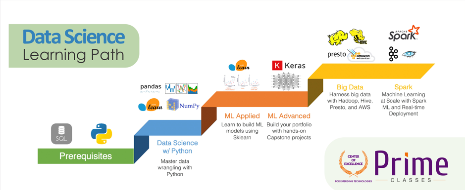

<table align="center">
<tr>
<td align="center" width="9999">

# Data Science Learning Path

</td>
</tr>
</table>
---

## DAFTAR Isi 

**

## Apa itu Data Scientist?

**

**Apa yang dilakukan oleh seorang Data Scientist**

[poin poin tentang jobs/tasks apa saja yang dilakukan oleh seorang data scientist], e.g.:

* Melakukan analisis terhadap data
* Mengekstraksi suatu insight dari data
* Membuat pemodelan (machine learning/deep learning) terhadap data untuk menemukan pola/pattern

## Apa saja yang harus dikuasai seorang Data Scientist?

[poin-poin tentang basic Knowledge dan skills yang harus dimiliki, poin-poin] e.g.:
* Ilmu statistika, stokastik, dan probabilitas
* Ilmu aljabar linier dan multivariate calculus
* Teknik visualisasi data
* Teknik storytelling
* Machine learning
* Deep Learning

## Learning Path Menjadi Data Scientist
[Flowchart/gambar/visualisasi path data scientist dari beginner sampai expert (**versi DSI**)] e.g:

## Daftar Course
## 1. Programing Menggunakan Python
### Mengapa ini penting?
Bayangkan bagaimana kita bisa memvisualisasikan data 3-dimensi dengan menggunakan *software* tertentu? Tidak semua *software* menyediakan fitur ini. Dari situlah *programming* menjadi penting. *Programming* berperan sebagai jembatan seorang *data scientist* untuk berkomunikasi dengan komputer sehingga memungkinkan mereka untuk dapat mengekseskusi berbagai perintah yg diinginkan secara *custom*. Sebagai contoh seperti di bawah ini
- Melakukan EDA menggunakan Pandas & Maptlotlib
- Melakukan training model dengan Scikit learn

### Apa saja yang akan dipelajari?
Course ini mempelajari mengenai dasar-dasar pemrograman menggunakan Python untuk pemrosesan data. Skill dasar untuk menulis program menggunakan Python untuk *Data Science* seperti *syntax* dasar, operasi dasar, logika, *looping*, struktur data, dan mengolah *database* menggunakan Python.

### Bagaimana mempelajari ini?
#### :books: Rekomendasi *Textbook*   
- [Python Data Science Handbook](https://jakevdp.github.io/PythonDataScienceHandbook/)
- [Automate the Boring Stuff with Python](https://automatetheboringstuff.com/)
- [Python for Everybody: Exploring Data in Python 3](https://www.py4e.com/book.php)

#### :clipboard: Rekomendasi Referensi Lain
:bulb: **Blog**
- [Python - Tutorials Point](https://www.tutorialspoint.com/python/python_basic_syntax.htm)

:chart_with_downwards_trend: **Practice Lab**
- [Kaggle Python](https://www.kaggle.com/learn/python)

### Topics
#### 1.1 Python Dasar
**Materi**
- Memahami syntax dasar
- Operasi matematika
- Looping

#### 1.2 Struktur Data Python
**Materi**
- Memahami string, list, dictionary, tuple, set
- Integer, float dalam Python

#### 1.3 Menggunakan Python Untuk Akses Database
**Materi**
- Memahami cara untuk mengakses data txt atau xlsx menggunakan Python

#### 1.4 Visualisasi menggunakan Python
**Materi**
- Dapat memvisualisasikan data menggunakan matplotlib, searborn, dll

## 2. Data Analysis and Visualization with Tableau
Course ini mempelajari tentang bagaimana cara melakukan visualisasi data menggunakan aplikasi Tableau. 

### Mengapa ini penting?
* Membuat dashboard untuk mengukur product performance
* Melakukan analisa data penjualan produk

### Apa saja yang akan dipelajari?
Tableau operations, data preparation, create charts, dashboards, and stories, do calculation, dll.

### Bagaimana mempelajari ini?

#### :books: Rekomendasi *Textbook*   
* [Communicating Data with Tableau: Designing, Developing, and Delivering Data Visualizations o](https://www.amazon.com/Communicating-Data-Tableau-Ben-Jones/dp/1449372023/ref=sr_1_1?s=books&ie=UTF8&qid=1463672144&sr=1-1&keywords=communicating+data+with+tableau)
* [Storytelling with Data: A Data Visualization Guide for Business Professionals](https://www.amazon.com/Storytelling-Data-Visualization-Business-Professionals/dp/1119002257/ref=pd_bxgy_14_img_2?ie=UTF8&refRID=1T58Z0WYEM95SMRXT3M4)

#### :clipboard: Rekomendasi Referensi Lain
#### Blog
* [Data Visualisation with Tableau](https://medium.com/@parulnith/data-visualisation-with-tableau-150f99a39bba)

#### Video
* [Tableau Free Training Videos](https://www.tableau.com/learn/training/20202#getting-started)

### Topics
#### 1.1 Getting Started with Tableau
Understand Tableau interface and operations as well as steps in working with Tableau.

#### 1.2 Data Preparation
Understand how to import and join data.

#### 1.3 Visual Analytics
Understand visual analytics features such as filter, sort, group, trend lines andhow to build dashboards.

#### 1.4 Calculation
Understand how to perform calculation in Tableau.

## 3. SQL
### Mengapa ini penting?
Course ini mempelajari tentang database yang umum digunakan dan bagaimana cara melakukan operasi di dalamnya.

- Membuat database untuk menyimpan data di sebuah aplikasi
- Melakukan akses database untuk mengambil sebuah data

### Apa saja yang akan dipelajari?
Course ini mempelajari mengenai dasar-dasar SQL untuk pemrosesan Data Science. Skill dasar untuk menulis program menggunakan SQL untuk Data Science seperti syntax dasar, operasi dasar, logika, looping, struktur data, dan mengolah database.

### Bagaimana mempelajari ini?
#### :books: Rekomendasi *Textbook*   
- [Query Solutions and Techniques for Database Developers ](https://www.amazon.com/SQL-Cookbook-Solutions-Techniques-Developers-ebook/dp/B0026OR3KI?tag=guru990f-20)
- [Optimization, Backups, and Replication](https://automatetheboringstuff.com/)

#### :clipboard: Rekomendasi Referensi Lain
**Blog**
- [SQL - Tutorials Point](https://www.tutorialspoint.com/sql/index.html)

**Practice Lab**
- [Kaggle SQL](https://www.kaggle.com/learn/intro-to-sql)

#### Video
* [SQL Training Videos](https://www.datacamp.com/courses/introduction-to-sql)

### Topics
#### 1.1 SQL Basic
understand how to select columns, filter row, do aggregation, sorting and groupping

#### 1.2 Story telling data
Understand how to import and join A Data Visualization Guide for Business Professionals

### Topics
#### 1.1 SQL Dasar
**Materi**
- Memahami syntax dasar
- Memahami struktur data
- Insert multiple record

**Buku**
**Video**
**Artikel**
**Lab**

#### 1.2 Struktur Data SQL
- Memahami string, list, dictionary, tuple, set
- Integer, float dalam Python

#### 1.3 Menggunakan SQL Untuk Akses Database
- Memahami cara untuk mengakses data txt atau xlsx menggunakan Python

#### 1.4 Visualisasi menggunakan Python
- Dapat memvisualisasikan data menggunakan matplotlib, searborn, dll

## 4. Probability & Statistics
### Mengapa ini penting?
Course ini mempelajari tentang teori dari probabilitas dan statistika yang umum digunakan pada bidang data science. Pada pengaplikasiannya di industri course ini digunakan untuk mempelajari karakteristik data, kualitas data, dan hubungan antara variabel data dengan masalah bisnis.

### Apa saja yang akan dipelajari?
Secara fundamental materi yang dipelajari adalah: *Probability & statistics essentials for data science.* dengan rincian *subcourse* beserta kompetensi dasarnya sebagai berikut.

- Probabilitas: Memahami fundamental probabilitas.
- Statistik Deskriptif: Memahami konsep dasar dari rata-rata, median, modus, standar deviasi, dan variasi.
- Statistik Inferensia: Memahami konsep dasar dari pengujian statistik.

### Bagaimana mempelajari ini?
#### :books: Rekomendasi *Textbook*   
- [All of Statistics: A Concise Course in Statistical Inference (Springer Texts in Statistics)](https://www.amazon.com/All-Statistics-Statistical-Inference-Springer/dp/1441923225)
- [Practical Statistics for Data Scientists: 50+ Essential Concepts Using R and Python](https://www.amazon.com/Practical-Statistics-Data-Scientists-Essential/dp/149207294X/ref=pd_sbs_14_6/138-4946098-2773951?_encoding=UTF8&pd_rd_i=149207294X&pd_rd_r=acb405e4-918c-4834-9c97-475386a02d5c&pd_rd_w=tZQVm&pd_rd_wg=kJKYT&pf_rd_p=b65ee94e-1282-43fc-a8b1-8bf931f6dfab&pf_rd_r=YVSV0KF6VNZAZRYMMAQ4&psc=1&refRID=YVSV0KF6VNZAZRYMMAQ4)
- [Introduction to Probability](http://www.dartmouth.edu/~chance/teaching_aids/books_articles/probability_book/amsbook.mac.pdf)
- [The Elements of Statistical Learning: Data Mining, Inference, a](https://www.amazon.com/Elements-Statistical-Learning-Prediction-Statistics-ebook/dp/B00475AS2E/ref=sr_1_1_sspa?dchild=1&keywords=element+of+statistical+learning&qid=1602248782&s=books&sr=1-1-spons&psc=1&spLa=ZW5jcnlwdGVkUXVhbGlmaWVyPUFVSlEyTEszVjJHNDQmZW5jcnlwdGVkSWQ9QTA1NjE3NjUyTTFNQjdTRkFIR0ZHJmVuY3J5cHRlZEFkSWQ9QTAxNTQ2NDEzMkdLRzFHUE40VVJJJndpZGdldE5hbWU9c3BfYXRmJmFjdGlvbj1jbGlja1JlZGlyZWN0JmRvTm90TG9nQ2xpY2s9dHJ1ZQ==)

#### :clipboard: Rekomendasi Referensi Lain
**Blog**
- [Part 1: Statistics and Probability in Data Science | Data Science 2020](https://medium.com/analytics-vidhya/statistics-and-probability-in-data-science-data-science-2020-5cbd41856cd3)
- [Part 2: Statistics and Probability in Data Science | Data Science 2020](https://medium.com/analytics-vidhya/part-2-statistics-and-probability-in-data-science-data-science-2020-ed74652b8318)

**Practice Lab**
- [Python Statistics Fundamentals: How to Describe Your Data](https://realpython.com/python-statistics/)

**Video**
- [Intro to Statistics](https://www.udacity.com/course/intro-to-statistics--st101)

## 5. Mathematics for Machine Learning
Course ini mempelajari tentang teori matematika yang digunakan pada metode machine learning.

### Mengapa ini penting?
* Digunakan untuk melakukan perhitungan evaluasi model machine learning
* Optimisasi algoritma machine learning

### Apa saja yang akan dipelajari?
Konsep matematika dasar (Linear algebra, Calculus and Vector calculus)

### Bagaimana mempelajari ini?

#### :books: Rekomendasi *Textbook*   
* [Communicating Data with Tableau: Designing, Developing, and Delivering Data Visualizations o](https://www.amazon.com/Communicating-Data-Tableau-Ben-Jones/dp/1449372023/ref=sr_1_1?s=books&ie=UTF8&qid=1463672144&sr=1-1&keywords=communicating+data+with+tableau)
* [Storytelling with Data: A Data Visualization Guide for Business Professionals](https://www.amazon.com/Storytelling-Data-Visualization-Business-Professionals/dp/1119002257/ref=pd_bxgy_14_img_2?ie=UTF8&refRID=1T58Z0WYEM95SMRXT3M4)

#### :clipboard: Rekomendasi Referensi Lain
#### Blog
* [Data Visualisation with Tableau](https://medium.com/@parulnith/data-visualisation-with-tableau-150f99a39bba)

#### Practice Lab
* 

#### Video
* [Tableau Free Training Videos](https://www.tableau.com/learn/training/20202#getting-started)

### Topics
#### 1.1 Vector and Matrix Operations
Understand basic concept to operating a table of data (a Matrix or Vector).

Buku
* [Matrix Computations](http://math.ecnu.edu.cn/~jypan/Teaching/books/2013%20Matrix%20Computations%204th.pdf)
* [Probability and statistics: The science of uncertainty](http://www.utstat.toronto.edu/mikevans/jeffrosenthal/)

Video
* [MIT OCW Multivariable Calculus](http://ocw.abu.edu.ng/courses/mathematics/18-02-multivariable-calculus-fall-2007/video-lectures/)

Artikel
* [A Gentle Introduction to Linear Algebra](https://machinelearningmastery.com/gentle-introduction-linear-algebra/)
* [Mathematics for Machine Learning](https://mml-book.github.io/)

Lab
* [Data Science and Linear Algebra Fundamentals with Python, SciPy, & NumPy](https://www.twilio.com/blog/2018/06/data-science-linear-algebra-python-scipy-numpy.html)

#### 1.2 Linear Algebra
Understand application of linear algebra within Data Science (Example Principle Component Analysis PCA).

Buku
* [Introduction to Linear Algebra, Fifth Edition (Gilbert Strang)](https://www.amazon.com/Introduction-Linear-Algebra-Gilbert-Strang/dp/0980232775/ref=sr_1_2?crid=1J781HHLGZH0E&dchild=1&keywords=linear+algebra+gilbert+strang&qid=1602248961&s=books&sprefix=linear+algebra+gilbert+%2Cstripbooks%2C399&sr=1-2)

Video
* [MIT OCW Linear Algebra](https://ocw.mit.edu/courses/mathematics/18-06-linear-algebra-spring-2010/)

#### 1.3 Calculus and Derivatives
Understand optimization function (finding local minima & maxima).

Video
* [MIT OCW Single Variable Calculus](https://ocw.mit.edu/courses/mathematics/18-01-single-variable-calculus-fall-2006/video-lectures/)

## 6. Data Visualization with Data Studio
Course ini mempelajari tentang bagaimana cara melakukan visualisasi data menggunakan aplikasi Google Data Studio.

### Mengapa ini penting?
* Membuat dashboard performa KPI tahunan
* Membuat dashboard penjualan produk di sebuah toko

### Apa saja yang akan dipelajari?
Data Studio navigation, build reports, and calculated fields.

### Bagaimana mempelajari ini?

#### :books: Rekomendasi *Textbook*   
* [Storytelling with Data: A Data Visualization Guide for Business Professionals](https://www.amazon.com/Storytelling-Data-Visualization-Business-Professionals/dp/1119002257/ref=pd_bxgy_14_img_2?ie=UTF8&refRID=1T58Z0WYEM95SMRXT3M4)

#### :clipboard: Rekomendasi Referensi Lain
#### Blog
* [The Ultimate Guide to Google Data Studio in 2020](https://blog.hubspot.com/marketing/google-data-studio)

#### Practice Lab
* [Google Data Studio Example](https://datastudio.google.com/u/0/navigation/reporting)

#### Video
* [Introduction to Data Studio](https://analytics.google.com/analytics/academy/course/10)

### Topics
#### 1.1 Data Studio basics
Understand how to operate Data Studio and create simple reporting

#### 1.2 Advanced Data Studio
Understand more advanced Data Studio features such as filters and calculated filed